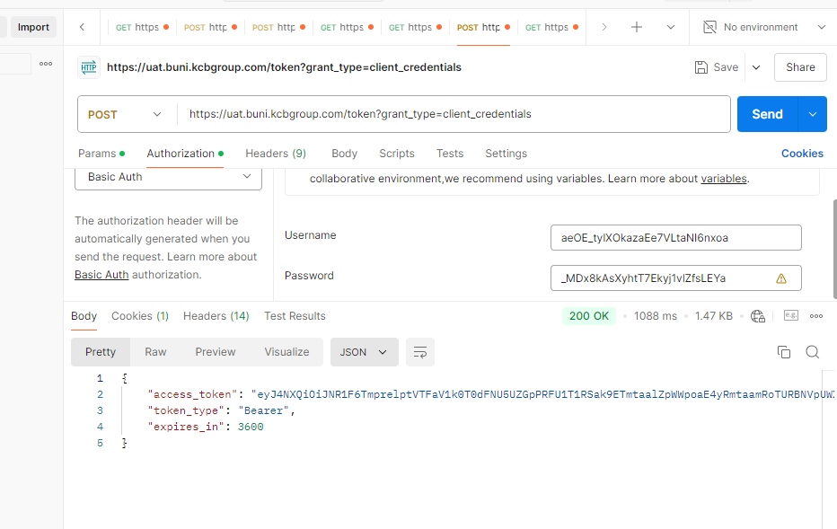
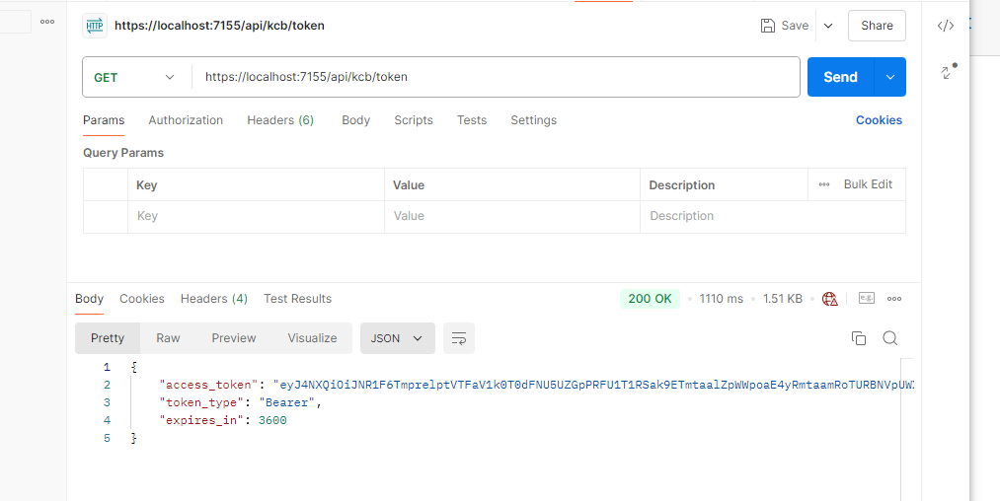
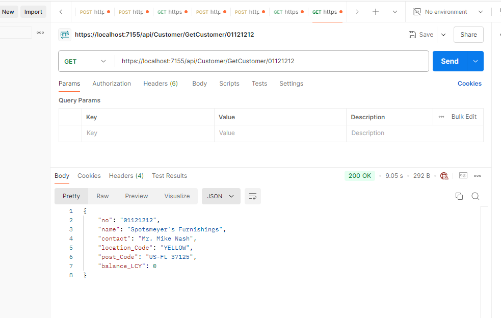
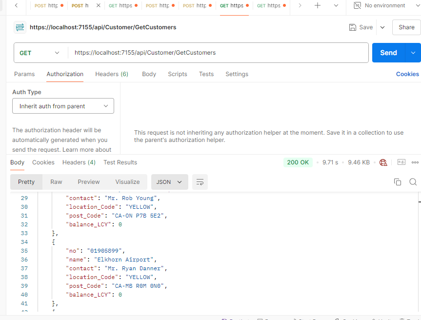
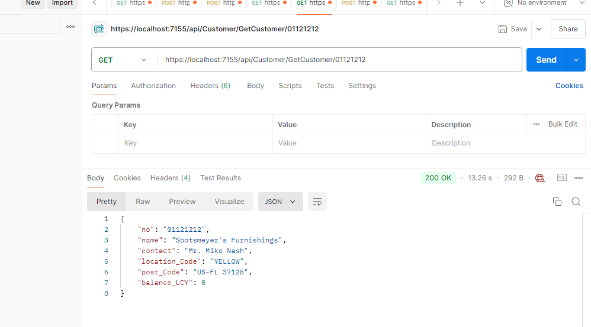
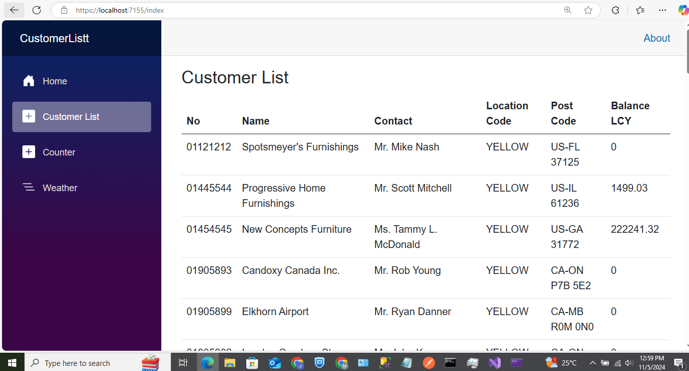
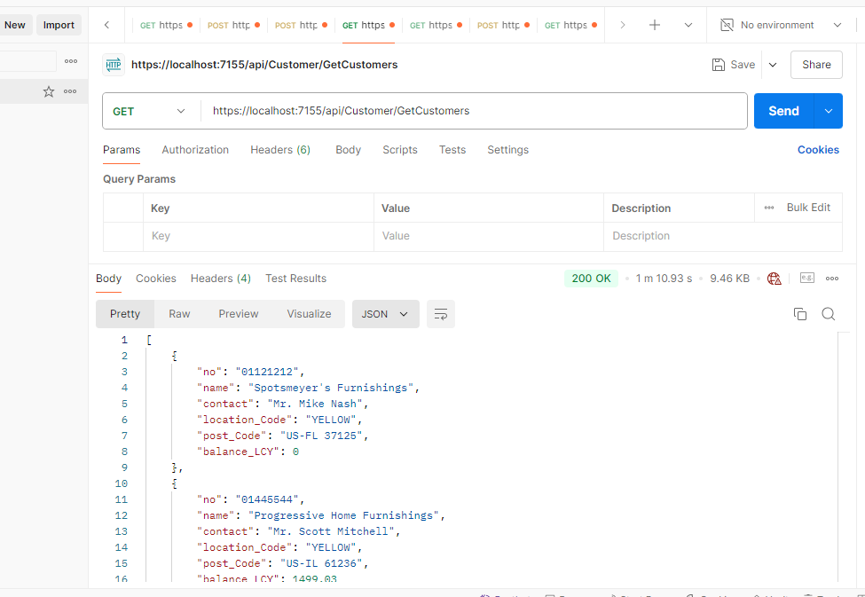

# Customer List and KCB API Project
This project demonstrates how to work with a customer list in various ways, including fetching customer-list, fetch by id. 
this is fetched from Microsoft Dynamic 365 Business Central.

The project also demonstrated the consuming of KCB endpoint using Basic auth base64 encoded information, which returns a token, Bearer and expiration time. 
## Project Structure

The solution structure is as follows:

- **CustomerListt.sln**: The main solution file.
- **images/**: A folder containing screenshots that illustrate different parts of the application.
-**CustomerListt/**: a project folder containing the C# .NET core code implementation

## Images

Here are some images showing the functionality and user interface of the application:

### API Interface

### Consumed API
This screenshot shows the consumed API.

### Customer by ID
This shows retrieving a customer by their ID.

### Customer List
This screenshot displays the list of customers.

### Get Customer by ID
This shows the UI for getting a customer by ID.

### Get Customers UI
This screenshot shows the UI for retrieving customers.

### Get Customers from BC
This displays getting customers from a business central source.

## Requirements

- .NET 7.0 or higher
- Visual Studio 2019 or later

## Additional Notes

The project has exposed the customer list as endpoint in REST API format (json) and the rest of the endpoints.
the project has also used razor pages to display the customer as seen above. 
